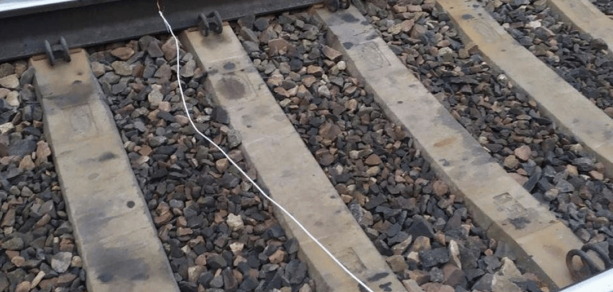

# Рельсовая война

Железные дороги - основной метод переброски военной техники, живой сили и ресурсов.

Ежедневно, по железным рельсам со всех уголков России стягивается мобилизированное мясо и груды военного металла на один большой обряд самоуничтожения экономики, государственности и нашего будущего - войну с Украиной.

Диверсии на таких важных узлах логистики точно не останутся незамеченными.&#x20;

* Перемычка
* Натяжитель
* &#x20;
* &#x20;
*

**Перемычка**

Если “замкнуть” два рельса при помощи проволоки, автоматика получит сигнал о том, что путь занят, и зажжет красный сигнал светофора.

Для этого нужно взять два куска проволоки 3мм длиной 70см и пружину длиной в свободном состоянии 10см ( подойдут любые от старых кроватей). На концах проволоки делаем крючки, между проволками крепим пружину, получаем "гирлянду". Установка проста: зацепил за один рельс растянул и за второй. Установка занимает около 5 сек.

Для этого нужны зажимы типа крокодил и кусок провода неменее 170 см. Провод припаиваем/обнимаем к зажимам. Установка проста и позволяет замаскировать перемычку.

**Натяжитель контактного провода**

На картинке натяжитель контактного провода. Скинув половину или больше будет большое провисание. По проезде поезда обрыв провода гарантирован. Задержко поездов до 5-6 часов. Но помните в контактном проводе 27 кВ. Грузы без напряжения.

.png>)


